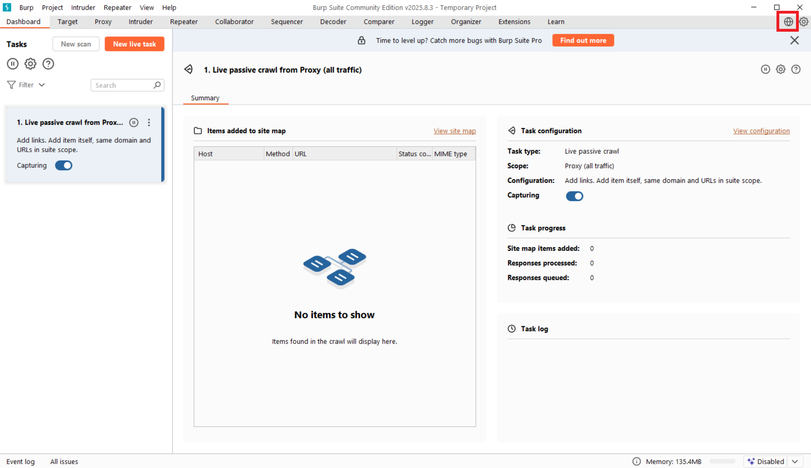
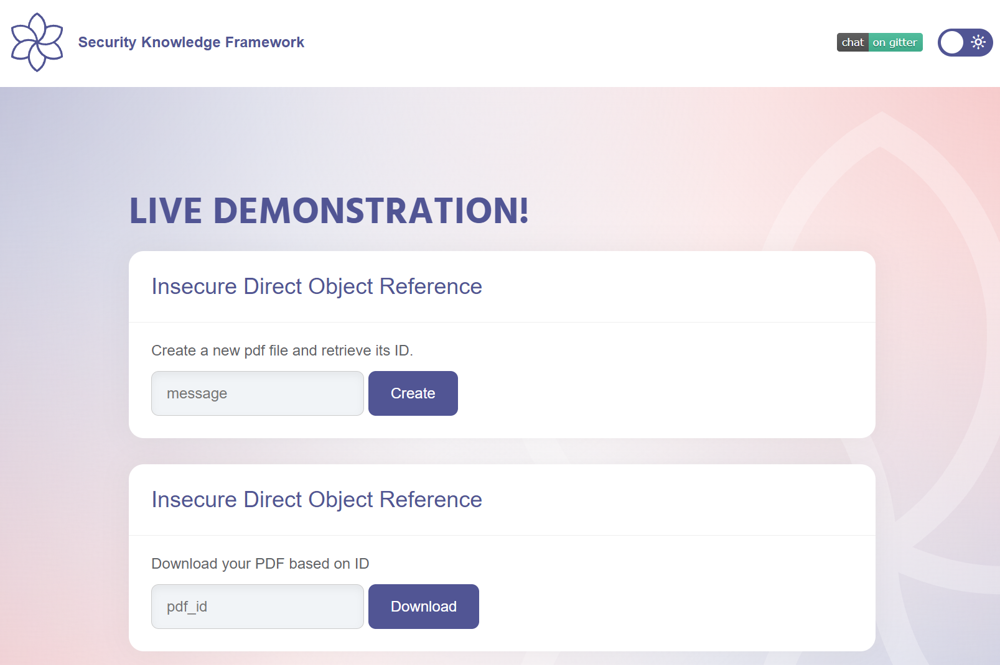
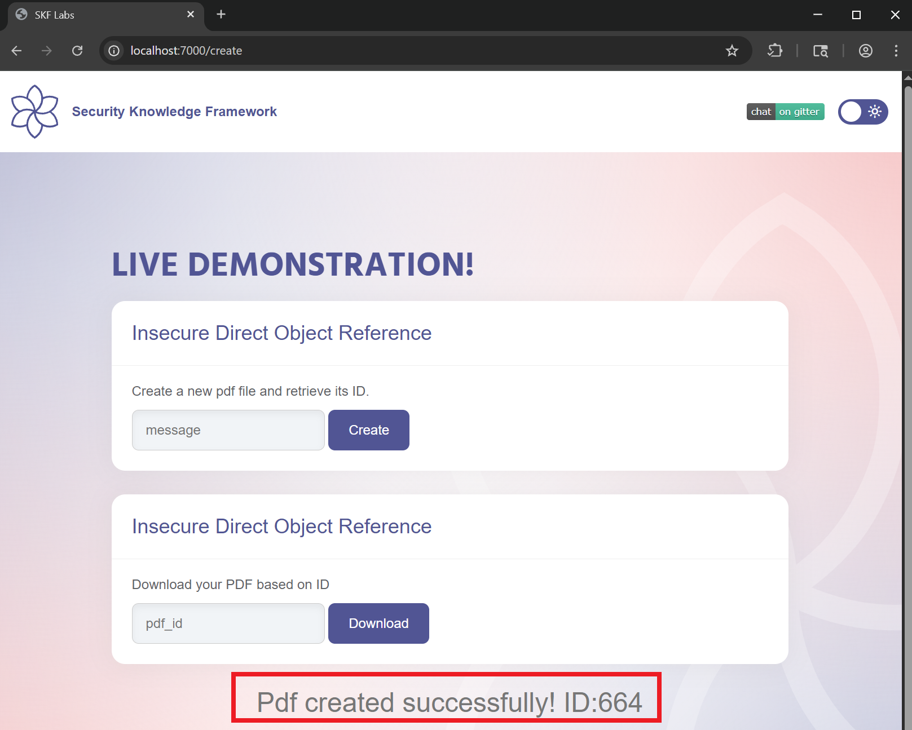
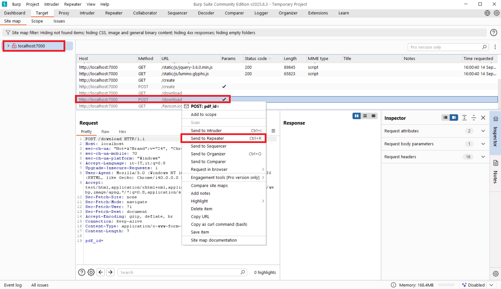
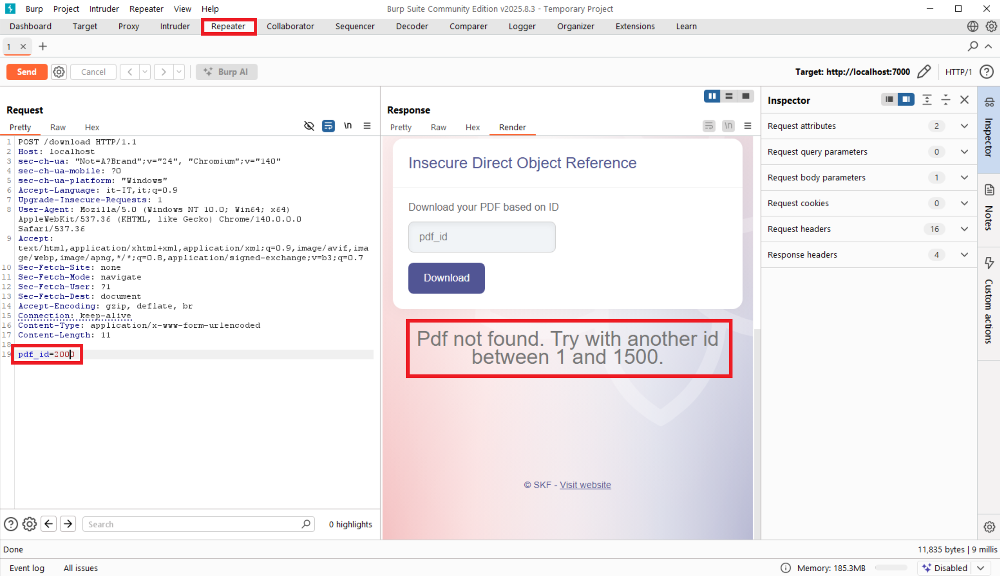
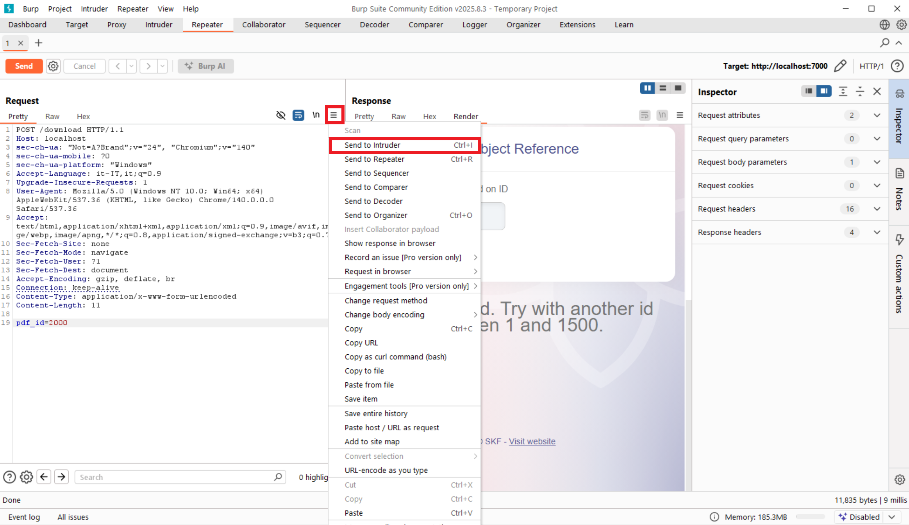
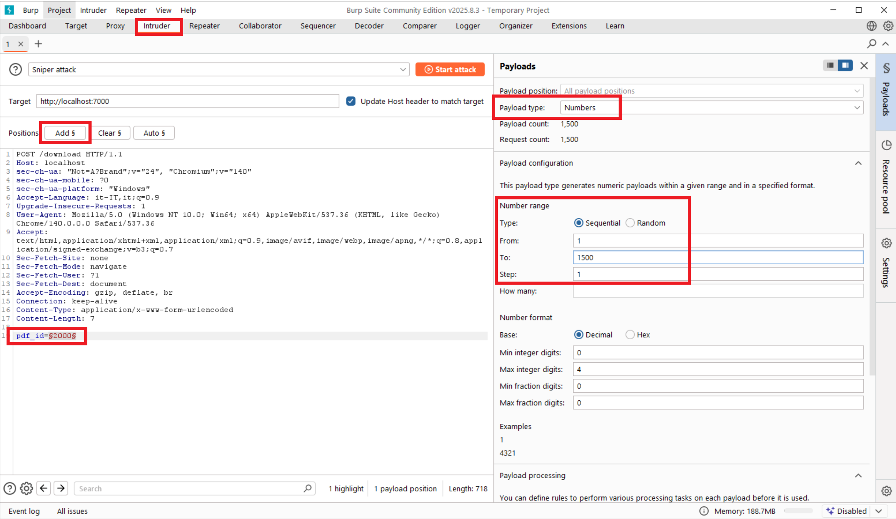
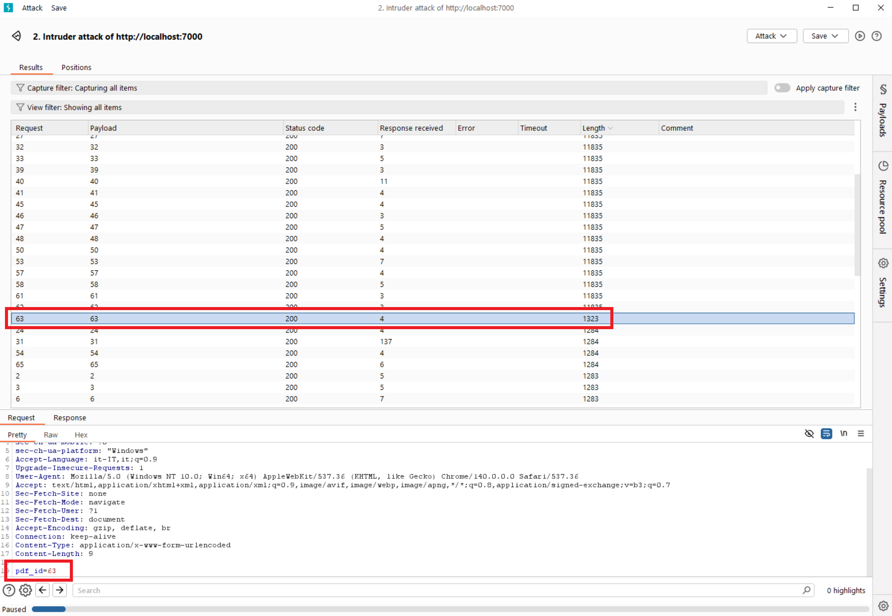
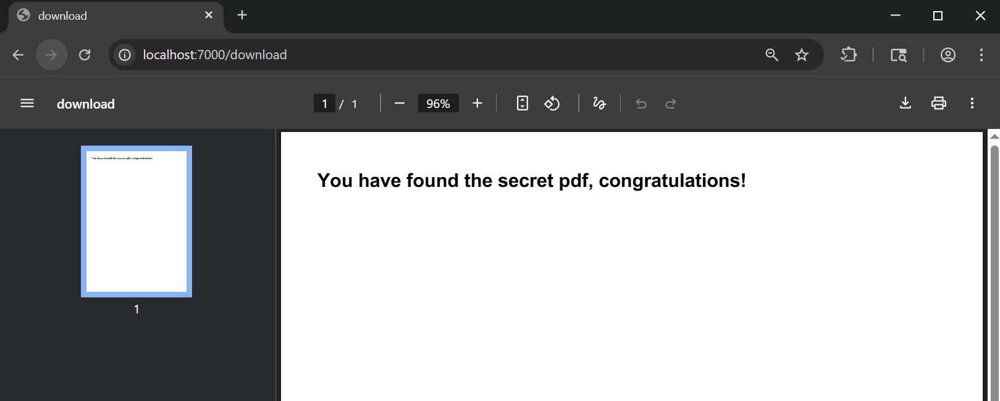

# Laboratorio IDOR

Questo laboratorio permette di testare vulnerabilità di tipo Insecure Direct Object References (IDOR) tramite esempi pratici.

## Come usare il laboratorio

1. Avvia il servizio IDOR tramite Docker Compose come indicato nel README principale.
2. Per questa demo è consigliato usare il web browser integrato in Burp Suite.
3. Segui la guida sotto e osserva il comportamento dell'applicazione per capire se è vulnerabile.

### 1. Burp Suite web browser
Per questa demo è consigliato usare il web browser integrato in Burp Suite. Questo perché ci permette di intercettare e modificare facilmente le richieste HTTP.

### 2. Accesso all'applicazione
Accedi all'applicazione tramite il web browser di Burp Suite all'indirizzo [http://localhost:7000](http://localhost:7000).

L'applicazione permette all'utente di creare un file PDF e di recuperare il file utilizzando l'indice assegnato.

Una volta intercetta una request di download, è possibile "inviarla" alle diverse sezione di Burp, in questo caso dobbiamo "inviare" questa request alla sezione Repeater:  

### 3. Burp Suite - Repeater
Nella sezione repeater possiamo modificare la request che abbiamo intercettato per provare a fare un attacco di ‘brute force’, inseriamo nella variabile ‘pdf_id’ un valore di 2000:

Da questo attacco abbiamo dedotto che il range di ID validi va da 1 a 1500.

### 4. Attacco di brute force
Per eseguire un attacco di brute force possiamo utilizzare la funzionalità di Intruder di Burp Suite. 

Configuriamo l'attacco in modo da variare il parametro `pdf_id` da 1 a 1500.

Dopo aver eseguito l'attacco, possiamo analizzare i risultati per identificare quali richieste hanno avuto successo (ad esempio, con codice di stato 200).

La richiesta con il payload 63 risulta interessante, poiché la lunghezza della risposta differisce da quella delle altre richieste, che invece sembrano restituire risposte uniformi. Questo potrebbe indicare un comportamento diverso o la presenza di dati rilevanti.

Se proviamo ad scaricare il pdf con l’id 63, possiamo vedere che il file contiene "informazioni sensibili".