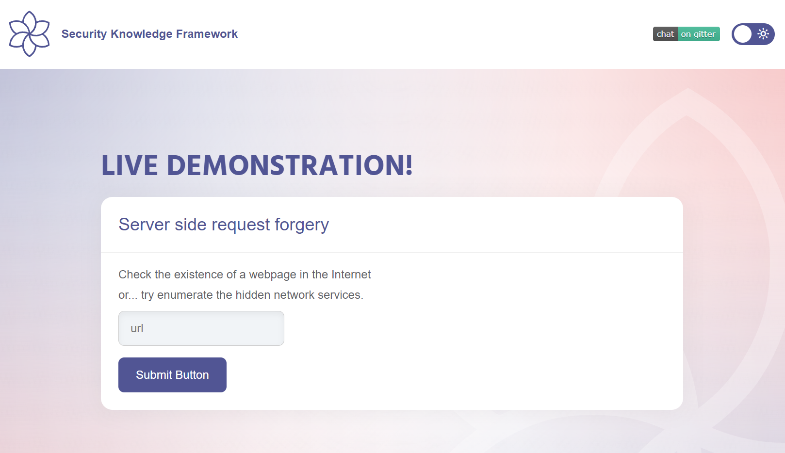
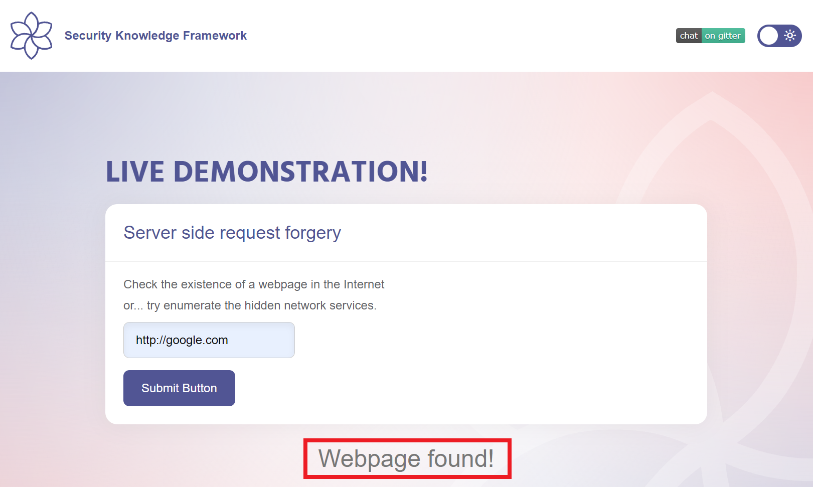
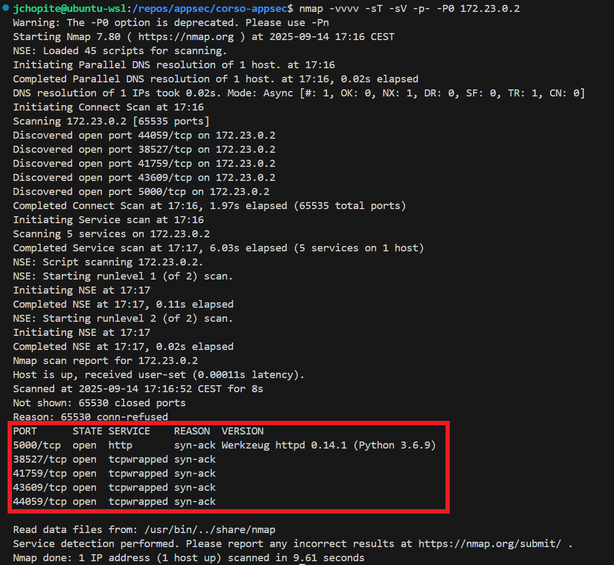
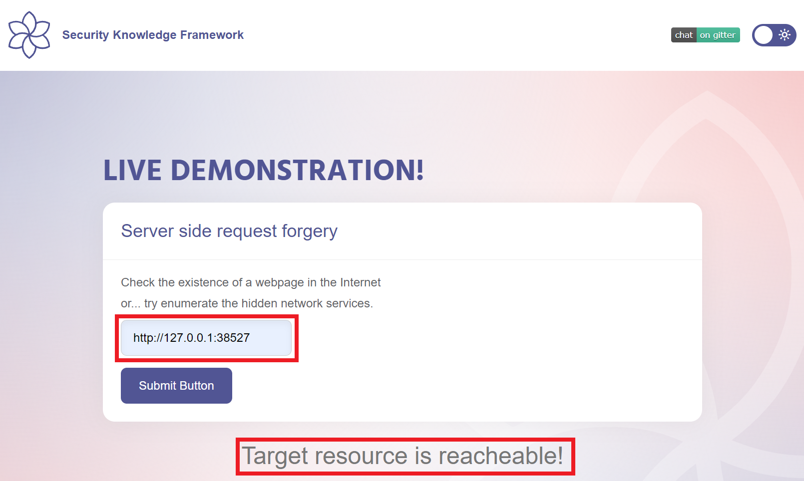
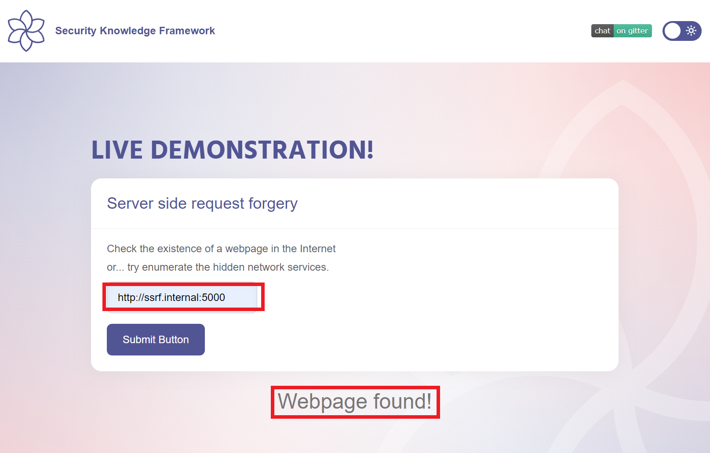

# Laboratorio SSRF

Questo laboratorio permette di testare vulnerabilità di tipo Server-Side Request Forgery (SSRF) tramite esempi pratici.

## Come usare il laboratorio

1. Avvia il servizio SSRF tramite Docker Compose come indicato nel README principale.
2. Per questa demo è consigliato usare il web browser integrato in Burp Suite.
3. Segui la guida sotto e osserva il comportamento dell'applicazione per capire se è vulnerabile.

### 1. Burp Suite web browser
Per questa demo è consigliato usare il web browser integrato in Burp Suite. Questo perché ci permette di intercettare e modificare facilmente le richieste HTTP.


### 2. Accesso all'applicazione
Accedi all'applicazione tramite il web browser di Burp Suite all'indirizzo [http://localhost:7003](http://localhost:7003).



L'applicazione include una funzionalità "keep alive", pensata per verificare se determinati siti web sono attivi e raggiungibili. Per esempio, puoi testare un sito come google.com:



### 3. Scansione delle porte 
Prima di provare a fare SSRF, possiamo eseguire una scansione delle porte del server per identificare quali servizi sono in ascolto. Questo ci aiuterà a capire quali endpoint interni potrebbero essere accessibili tramite SSRF.
Usiamo nmap per eseguire una scansione delle porte comuni, ma prima dobbiamo scoprire l'indirizzo IP del container Docker che esegue il servizio SSRF. Possiamo farlo eseguendo il comando:

```bash
docker inspect -f '{{range .NetworkSettings.Networks}}{{.IPAddress}}{{end}}' appsec-lab-ssrf
```

Supponiamo che l'indirizzo IP restituito sia `172.23.0.2`.

```bash
nmap -vvvv -sT -sV -p- -P0 172.23.0.4
```



### 4. Attacco SSRF
Ora che sappiamo quali porte sono aperte, possiamo tentare di sfruttare la vulnerabilità SSRF per accedere a questi servizi interni:



### 5. Accesso a servizi interni
Oltre a testare la raggiungibilità di servizi sullo stesso host, possiamo anche tentare di accedere a servizi interni che non sono esposti direttamente all'esterno.
Ad esempio, nel docker compose è presente un servizio web (ssrf.internal), non esposto all'esterno, in esecuzione sulla porta 5000 (porta di default per gli esempi SKF). Possiamo provare a fare una richiesta SSRF a questo servizio:


